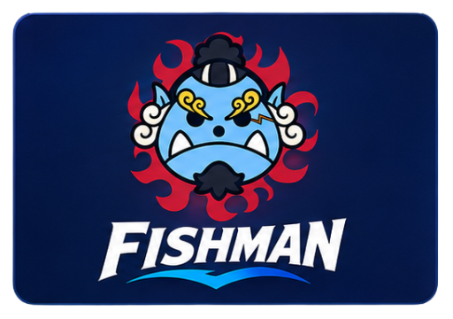
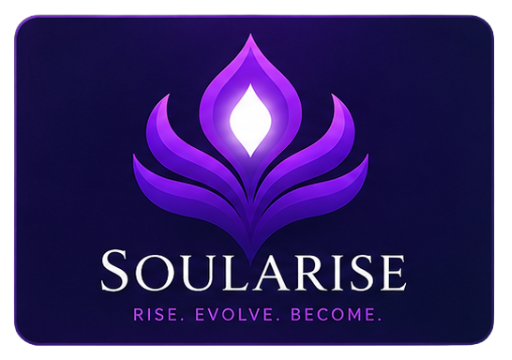
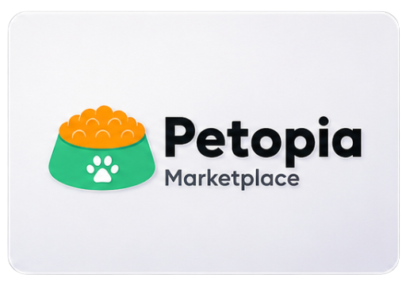
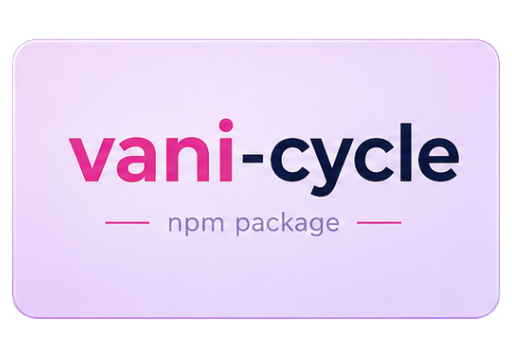
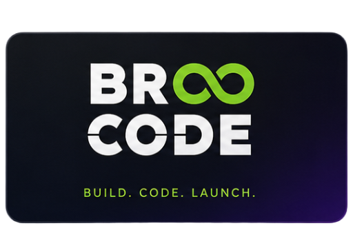

  

 

# Hi, I'm Narendra Nishad

**Software Developer** · React · Next.js · React Native · Rust  

I build clean, fast products across web and mobile — from concept to ship.

 

---

### About

Results-driven developer with experience shipping **mobile, web, and desktop apps**. Focused on clean UI/UX, performance, and scalable architecture.

- Currently building **Fishman** — open-source native API IDE (Tauri + React)
- Also building **Soul Arise** — gamified habits & self-improvement
- Looking for **open-source** collaboration and contributions
- Open to collaboration, freelance, and full-time opportunities
- Ask me about **React**, **Next.js**, **React Native**, **Rust**, desktop apps, and product UX

---

### Featured Projects

| Preview | Project | What it does | Stack | Links |
| :---: | :--- | :--- | :--- | :--- |
|  | **Fishman** | Open-source native API IDE — scan backends, build collections, test APIs locally | Tauri v2, React, Rust | [Live](https://nkrider7.github.io/fishman/) · [Code](https://github.com/nkrider7/fishman) |
|  | **Soul Arise** | Gamified habit & quest tracker inspired by Solo Leveling — streaks, levels, rewards | React Native, Expo | [Live](https://soularise.netlify.app/) · [Code](https://github.com/nkrider7/soularise) |
|  | **Petopia** | Pet marketplace & adoption platform | React, Node.js, React Query | [Live](https://pals-petopia.netlify.app/) · [Code](https://github.com/nkrider7/Group-5-Petopia_Market) |
|  | **Vanicycle** | TypeScript cycle engine — period, ovulation & fertile-window predictions for apps | TypeScript | [Live](https://nkrider7.github.io/vani/) · [Code](https://github.com/nkrider7/vani) |
|  | **Medcare** | Healthcare platform focused on clean UI and patient-friendly digital care | React, Next.js | [Live](https://medcareindia.netlify.app/) |
|  | **Broocode** | Web & app development agency site — growth-focused digital products | Next.js, React | [Live](https://broocode.vercel.app/) |

🚀 More Projects & Portfolio 

### 🌐 View my complete portfolio: **[narendra7.is-a.dev](https://narendra7.is-a.dev/)**

 

<table><tr><td valign="top" width="100%">

### 💻 Other Projects

| **Project Name** | **Description** | **Link** |
| --- | --- | --- |
| **[Boomzo Website](https://www.boomzo.in/)** | SEO-friendly company site with performance focus — Next.js, Tailwind. | [View Project ❯](https://www.boomzo.in/) |
| **[MediHelp Global](https://medihelpglobal.com/)** | Responsive healthcare site with international reach — Web, SEO. | [View Project ❯](https://medihelpglobal.com/) |
| **[TechTrail DMC](https://www.techtraildmc.com/)** | Travel / DMC site — responsive UI & SEO setup. | [View Project ❯](https://www.techtraildmc.com/) |

</td></tr></table>

---

### Experience

**Software Developer** · KitFit · *Sep 2025 – Mar 2026*  
Building women’s health & menstrual tracking experiences with React, Next.js, and React Native.

**React Native Developer** · Boomzo · *Jul 2024 – Jul 2025*  
Shipped mobile/web apps with Expo & Next.js; redesigned boomzo.in with SEO and performance wins.

**Full Stack Intern** · DevXquad · *May 2024 – Jul 2024*  
Built Next.js apps (including a link shortener) with Shadcn UI and Tailwind CSS.

---

### Tech Stack

  
  
  
  
  
  
  
  
  
  
  
  

---

### GitHub Stats

  <!--  -->
  

<!--   -->

<!-- 

  

 -->

---

### Connect

 

⭐ From [nkrider7](https://github.com/nkrider7) — let’s build something useful.

